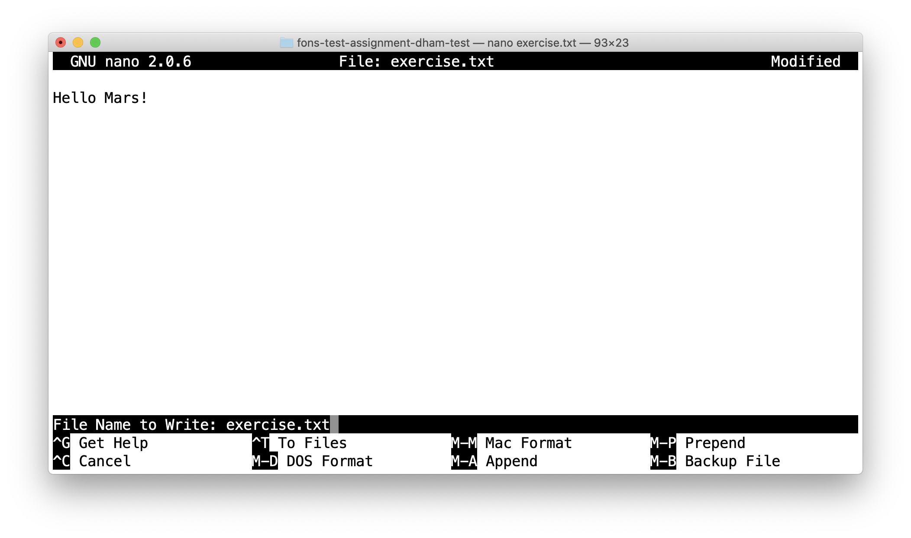

.. _git:

Git and GitHub Classroom
========================

.. contents:: 
    :local:

Introduction
------------

`Git <https://git-scm.com>`__ and `GitHub <https://github.com>`__ Classroom are
used in some modules to distribute programming coursework, enable you to manage
your code while completing the exercises, and then to help with submission.

.. note::

    This introduction just provides enough information to enable you to set up
    and use Git and GitHub Classroom for your coursework. For a more in-depth
    introduction to Git and GitHub, you are encouraged to work through the
    excellent `Git tutorial provided by the Software Carpentry project
    <http://swcarpentry.github.io/git-novice/>`_.
    
What is Git?
~~~~~~~~~~~~

When we're writing code, we typically don't just type it out, notice that it
works, and stop. Instead, the usual cycle looks a bit more like this:

1. Write a small piece of code.
2. Use it to run some test problems to see if it works.
3. If there were problems, make a change and go back to step 2.
4. Once it's working, go back to step 1 and write the next small piece of code.

Each time we get to step 4, we're a little closer to having a working program
that does what we want. However, each time we go back through steps 1-3, we run
the risk that we don't just implement a new feature, but that in doing so we
break something we already had working. How do we make sure that we always know
exactly what the code used to look like when it worked? 

One answer is to keep saving old versions under different names. This is a bad
answer for two reasons. The first is that it swiftly descends into a confused
mess, as anyone who has ever been emailed a Word file named
`report_draft_final_revised2_johns_comments.doc` can attest! The second is that
the names of files and code objects often matter to programming languages - so
the mere action of saving your code under a different name can stop it working.

The right answer to the problems caused by constantly updating code (or any
other document) is a version control system. A version control system is a piece
of software which keeps track of versions of a collection of files such as a
software project. A well-used revision control system can tell you:

1. What changed in the files.
2. When the change happened.
3. Who made the changes.

Revision control systems also help with the edit conflicts that can occur
when more than one person edits a file, for example as a part of a group
project - or even when you edit the same file on two different computers.

Git is one such revision control system, and it's one of the most capable and
widely used currently available.

What is GitHub?
~~~~~~~~~~~~~~~

Git keeps track of a collection of files stored in a project folder called a
repository which is kept on your computer. That's great but what if you want to
do any of the following?

1. Collaborate with someone else who also needs to edit the files.
2. Work on more than one computer.
3. Still have your repository if your computer is lost or your hard disk dies.

`GitHub <https://GitHub.com>`_ is a cloud service which stores copies of Git
repositories online. You can `push` your changes up to GitHub from any computer
with an internet connection and `pull` those changes down to any other computer.
GitHub also integrates with other software development tools such as automatic
testing frameworks, issue trackers and code review to provide a comprehensive
software development platform. Depending on the module you are taking, you may
also use some of these extra features of GitHub, but we will mostly focus on how
to use the core feature of storing a copy of your repository online.

What is GitHub Classroom?
~~~~~~~~~~~~~~~~~~~~~~~~~

All of the collaborative features of Git and GitHub might sound like overkill
when all you need to do is complete coding assignments that only you work on.
However in software development terms, you always have at least one collaborator
on your assignments: the module lecturer. Usually the lecturer provides some
initial skeleton code, such as some incomplete source files or Jupyter
notebooks. During the course of the work, you might need to show your code to
the lecturer or a teaching assistant in order to get help, and at the end you
need to share your work with the module staff to get it marked.

GitHub Classroom is a service that works with GitHub to provide every student
doing a particular coding exercise with their own repository on GitHub that's
prepopulated with the lecturer's skeleton code and ready to work with. As we'll
see below, this makes it really easy to obtain the exercise and work with it.

Installing Git
--------------

.. _git-windows:

Windows
~~~~~~~

Direct download
...............

To install Git directly, navigate to `the Git Windows download website
<https://git-scm.com/download/win>`__. If the download doesn't start
immediately, click on `Click here to download manually`. Run the installer.
Unless you have specific reasons to do otherwise, it's reasonable to accept all
the defaults by clicking `next` each time.

Now proceed to :ref:`check the install <check_git>`.

Software Hub
............

Follow the instructions on `the Imperial Software Hub website
<https://www.imperial.ac.uk/admin-services/ict/self-service/computers-printing/devices-and-software/get-software/software-hub/>`_.

The version of Git on Software Hub is somewhat older and has compatibility
issues with the most recent versions of :ref:`Visual Studio Code
<visual-studio-code>`.

Now proceed to :ref:`check the install <check_git>`.

MacOS
~~~~~

All recent versions of MacOS come with Git pre-installed. This version is likely
to be good enough for many students on many modules, though it probably won't be
the most recent release.

If you want a more recent version and you've :ref:`installed Homebrew
<homebrew>` then installing Git is as simple as :ref:`opening a terminal
<macos_terminal>` and running the following command:

.. code-block:: console

    $ brew install git

Now proceed to :ref:`check the install <check_git>`.

If you need a more recent version of Git and you don't want to install Homebrew
for whatever reason, then there are more options on `the Git MacOS download
website <https://git-scm.com/download/mac>`_.

Linux
~~~~~

Every Linux distribution ships Git through its package manager. The easiest way
to install Git is usually to simply do whatever it is that is normal on your
distribution to install software. For example on Ubuntu or any other
Debian-based system you would run this in the terminal:

.. code-block:: console

    $ sudo apt-get install git

While on Fedora and related distributions, you would run:

.. code-block:: console

    $ sudo dnf install git

or if you're using an older version of these distributions:

.. code-block:: console

    $ sudo yum install git

If you're using a different Linux distribution then you'll probably find the
correct install line `on the Git Linux download website <https://git-scm.com/download/linux>`_.

.. _check_git:

Check the install
~~~~~~~~~~~~~~~~~

Check that you've got a successfully working Git by running this in the
:ref:`terminal`:

.. code-block:: console

    $ git --version

The expected output is something like:

.. code-block:: console

    git version 2.28.0

The exact version may be a little different. This is not important.

Proceed now to :ref:`configure Git <configure_git>`.

.. _configure_git:

Configuring Git
---------------

Git needs a little bit of configuration to work smoothly. This configuration
belongs to the computer you're running Git on, so you don't have to do this for
each project, but you do have to do it for each computer you log into. If you're
using Imperial's lab machines remotely, these all share user home directories so
you should not need to redo the Git configuration each time you log into a new
lab machine: one configuration is enough for them all.

Your details
~~~~~~~~~~~~

First you need to tell Git about your name and email address. This has nothing
directly to do with the information you provided to GitHub, instead it will just
be used by Git to label you as the author of the code that you write. To save on
a great deal of confusion later, you should register the actual name that you
usually go by. Similarly, please use your Imperial email address. :ref:`Open a
terminal <terminal>` and run the following commands, replacing your name as
appropriate:

.. code-block:: console

    $ git config --global user.name "Jo Student"
    $ git config --global user.email "Jo.Student20@imperial.ac.uk"

Line endings
~~~~~~~~~~~~

When a text file, such as a program source file, contains a line break, this is
represented by a special invisible character. Unfortunately, it's not the same
character on different operating systems, which can make a bit of a mess when a
file is created on one operating system, and then edited on another - such as
might happen if your lecturer uses a different operating system for you. We can
set up Git to automatically clean up this mess in most cases.

Windows
.......

Run the following command in the :ref:`Git Bash terminal <terminal>`:

.. code-block:: console

    $ git config --global core.autocrlf true

MacOS or Linux
..............

Run the following command in the :ref:`terminal <terminal>`:

.. code-block:: console

    $ git config --global core.autocrlf input

Text editor
~~~~~~~~~~~

Git sometimes needs you to write a text comment. When this is the case, it will
launch a text editor to enable you to type the comment in. If you don't have
strong preferences for a particular editor, then `nano` is a good choice, so run
the following line in the terminal:

.. code-block:: console

    $ git config --global core.editor "nano -w"

If you have a favourite text editor, you can set it using the `Software
Carpentry instructions
<https://swcarpentry.github.io/git-novice/02-setup/index.html>`_.

Signing up to GitHub
--------------------

You will need your own GitHub account. This is completely
separate from your Imperial College computer account so you need to sign up
separately. If you've already got a GitHub account then you don't need another
one. Assuming you don't already have an account, 
click on `the GitHub signup page
<https://github.com/join?ref_cta=Sign+up>`_.

There are three fields to fill out:

Username
    You can use any name that is not already taken on GitHub. It doesn't need to
    have any relationship to your Imperial account name.

Email Address
    You need to use a real email address that works and you have access to, as
    GitHub will send you a verification email which you need to respond to. It
    is a very good idea to use your Imperial email address as this will make it
    easier to sign up for a GitHub Student Developer Pack (see below).

Password
    Choose a good, secure password. Do **not** use the same password as you use
    for your Imperial computer account.

.. container:: vimeo

    .. raw:: html

        <iframe src="https://player.vimeo.com/video/458177178" 
        frameborder="0" allow="autoplay; fullscreen"
        allowfullscreen></iframe>
        

Obtaining the GitHub Student Developer Pack
~~~~~~~~~~~~~~~~~~~~~~~~~~~~~~~~~~~~~~~~~~~

GitHub provide upgraded "pro" accounts and a bundle of other online tools for
free to students. You don't need this for your Imperial modules, but some of it
may be nice to have if you intend to do more software development as a student.
You can `register for the Student Developer Pack here
<https://education.github.com/pack>`_. Part of the registration is to verify
your student status, and one of the things that GitHub uses for this is your
email address so if you didn't use your Imperial email address to register your
GitHub account, you might want to `add your Imperial email address to your
GitHub account
<https://docs.github.com/en/enterprise/2.15/user/articles/adding-an-email-address-to-your-github-account>`_.

.. _github_classroom_exercise:

Doing coursework using GitHub Classroom
---------------------------------------

Some modules use GitHub Classroom to distribute, manage, and submit
computational coursework. This is a trivial example which shows you how to
obtain and work with Git and GitHub to do your coursework.

.. container:: vimeo

    .. raw:: html

        <iframe src="https://player.vimeo.com/video/458609356"
        frameborder="0" allow="autoplay; fullscreen"
        allowfullscreen></iframe>

Accepting the assignment
~~~~~~~~~~~~~~~~~~~~~~~~

For each GitHub Classroom assignment, your module will provide access to a link
that you can use to accept the assignment. In this case, there is a tiny toy
assignment created just for this exercise. `Accept the assignment by clicking
here <https://classroom.github.com/a/cChf4oeV>`_.

When you click on the assignment, if you're not already logged into your `GitHub
<https://GitHub.com>`_ account then you will be prompted to do so. If this is
your first GitHub Classroom assignment, you'll also be asked to give GitHub
Classroom permission to access your GitHub account. You should do so.

You will now be asked to accept the assignment. Do so by clicking on the large
green button. GitHub Classroom will now create a new repository containing your
personal copy of the assignment. You can click on the link provided to navigate
to your new GitHub repository. You will also receive an email inviting you to
this repository. Depending on which module you are taking, the repository might
be in a GitHub organisation which uses Imperial's authentication system. If it
does, then you'll be redirected to Imperial's login page and you'll need to
enter your Imperial (not GitHub) username and password.

If we scroll down on the front page of the GitHub repository website, we see the
README file for the repository. In this case, this gives us the instructions for
the assignment. Depending on the module, the instructions might be somewhere
else, such as on a module website or on Blackboard. This time, we see this:

.. image:: _static/git_exercise.*

So what we have to do is:

    1. Edit `exercise.txt` to replace "Hello World" with "Hello Mars!"
    2. Commit this change.
    3. Push the result to GitHub.

We'll go through each of these steps and what they mean below. First, though,
we'll need to clone the repository to our computer.

Cloning the repository
~~~~~~~~~~~~~~~~~~~~~~

Your new repository currently exists only on `GitHub <https://github.com>`_, but
you need a local copy on your machine (or on a remote machine that you're logged
into) in order to work on it. This is called cloning the repository. Here
we show how to do this using commands in the terminal, because this approach is 
the most likely to be available on all systems.
So, start by :ref:`opening a terminal <terminal>`. 

Next, you will need the URL of your GitHub repository. On the repository
webpage, click on the large green `Code` button on the right:

.. image:: _static/git_clone.*

Click on the little picture of a clipboard to copy the URL. Now, back in your
terminal type (without pressing `enter`):

.. code-block:: console

    $ git clone

Paste the URL you copied into the terminal after `clone` and then press `enter`.
If you are asked for your GitHub username and password, enter them, and the
repository will download. The process should look a little like this:

.. code-block:: console

    $ git clone https://github.com/imperiallearn/fons-test-assignment-dham-test.git
    Cloning into 'fons-test-assignment-dham-test'...
    remote: Enumerating objects: 24, done.
    remote: Counting objects: 100% (24/24), done.
    remote: Compressing objects: 100% (18/18), done.
    remote: Total 24 (delta 5), reused 5 (delta 0), pack-reused 0
    Unpacking objects: 100$ (24/24), 4.04 KiB | 172.00 KiB/s, done.
    $ 
        
This will create a new folder in the current folder containing the repository.
The folder will have the same name as the repository on GitHub, so in this case
it's called `fons-test-assignment-dham-test`. The command to change the current
folder is `cd` (for "change directory") so we now change into our repository:

.. code-block:: console

    $ cd fons-test-assignment-dham-test

We can now check that we're in the folder we think we're in by running the
command `pwd` ("print working directory"):

.. code-block:: console

    $ pwd
    $ /Users/dham/fons-test-assignment-dham-test

This shows me that we're in the `fons-test-assignment-dham-test` folder in my user
folder (`/Users/dham`), which is what I expect.

Editing `exercise.txt`
~~~~~~~~~~~~~~~~~~~~~~

I can now check out what's in
this folder with the `ls` command (for "list"):

.. code-block:: console

    $ ls 
    LICENSE		README.rst	exercise.txt	tests

There are four files or folders here, one of which is `exercise.txt`, which is
the one I need to edit. I could use any text editor for this purpose, for
example if I have Visual Studio Code installed then this would be a very
suitable editor. However here we'll only assume that you've installed `Git` so
we'll use the very basic editor `nano`, which is almost certainly installed:

.. code-block:: console

    $ nano exercise.txt

This will open the nano editor in your terminal. You should see something like
the following:

.. image:: _static/nano.*

Now you can use the arrow keys and keyboard to delete "World" and replace it
with "Mars!" (rememember the exclamation mark!) Don't try to move to the end of
the line by clicking with the mouse, that won't work (nano is far too basic for
that!)

Once you've edited the line, you need to save the file and quit nano. Helpfully,
nano shows a lot of its options along the bottom of the screen. We just need to
know that the caret symbol (`^`) stands for the `control` key. So we press
`control + O` to write out (save) our changes (Note for Mac users, this really
does mean the `control` key, and not ⌘). Nano will offer us the option of
changing the filename, but we don't want to do that so we just press `enter` to
save to the same file:

Next we quit nano by typing `control + X`.

Committing our changes
~~~~~~~~~~~~~~~~~~~~~~

Now that we've changed `exercise.txt`, we need to tell Git to record this
change. Each change (to one or many files) that we tell Git about is called a
"commit" and the process is called "committing". First, we take a look at what
Git can currently see about our repository. The command for this, indeed the go
to command whenever you're not quite sure what's going on in your Git
repository, is:

.. code-block:: console

    $ git status
    On branch master
    Your branch is up to date with 'origin/master'.

    Changes not staged for commit:
       (use "git add <file>..." to update what will be committed)
       (use "git restore <file>..." to discard changes in working directory)
    	     modified:   exercise.txt

    no changes added to commit (use "git add" and/or "git commit -a")

Let's pull this apart line by line. The first line says that we're on the
`master` branch. Branches are a somewhat more advanced feature, but here we only
need to understand that `master` is the default name for the main place to store
commits in a Git repository. 

To understand the second line, we need to know that Git, by default, calls our
repository on GitHub `origin`. So the second line means that, as far as Git can
see, every commit that exists on our machine is also on GitHub, and vice versa.

Next comes a blank line, we'll come back to what might appear there shortly. The
next line says "Changes not staged for commit". This means that Git can see that
these files have changed or have been added, but Git has not been told that they
should be committed. Git is also very helpful in telling us what we probably
want to do next, so we are informed that we can tell Git that we intend to
commit a file using `git add`, or we can undo the changes in a file back to the
last committed version using `git restore`. Finally, Git tells us that right now
there are no changes added to commit, so we either need to use `git add` or the
shortcut version `git commit -a`. We'll come back to the second of those
presently, but first let's learn about `git add`.

Staging files for commit
........................

We want to commit our changes to `exercise.txt`, so we tell Git to add it to the
list of files to be committed:

.. code-block:: console

    git add exercise.txt

We can check what that did by running `git status`:

.. code-block:: console

    $ git status          
    On branch master
    Your branch is up to date with 'origin/master'.

    Changes to be committed:
      (use "git restore --staged <file>..." to unstage)
    	modified:   exercise.txt

The first two lines of the output are unchanged, but now we see that
`exercise.txt` appears on the list of changes to be committed. We say that the
changes are "staged" for commit. Git once again helpfully tells us that if we
didn't mean to do that then we should use the command `git restore --staged` to
unstage the file. However, we did mean to stage `exercise.txt` so now we can go
on to make the actual commit.

.. warning::

    Some sites on the internet advocate the following version of `git add`:

    .. container:: badcode

        .. code-block:: console

            $ git add -A

    This is a **very bad** idea. What this command does is stage for commit
    every file in the repository that is not exactly the same as the already
    committed version. This can include any number of automatically generated
    binary files that you have generated or that your computer uses to manage
    the file system. Committing these files makes a complete mess of your
    repository and can cause conflicts if you try to clone your repository on
    another machine. Don't use `git add -A`!

The actual commit
.................

Having staged the file(s) for commit, we need to actually make the commit. We do
this with the following command:

.. code-block:: console

    $ git commit -m "Changed World to Mars"
    [master 7ad3846] Changed World to Mars
     1 file changed, 1 insertion(+), 1 deletion(-)

`git commit` tells Git to commit all staged files. Git always needs a message
describing what has changed. I've provided this by passing the `-m` option
followed by the commit message in quotation marks. If I were to leave off the
`-m` option and commit message, then Git would open the text editor I configured
earlier (nano) for me to enter the commit message. I would save the commit
message and quit the editor, after which the commit would go ahead as above.

Let's use our go to command, `git status` to see what we've done:

.. code-block:: console

    $ git status
    On branch master
    Your branch is ahead of 'origin/master' by 1 commit.
      (use "git push" to publish your local commits)

    nothing to commit, working tree clean

This is now quite different from what we've seen before. We're still on branch
master, but now we're informed that we're ahead of `origin/master` by one
commit. This is because we've made a commit locally on our machine, but we
haven't yet pushed that change up to GitHub. Git helpfully informs us that we
could remedy this situation using `git push`. Because we've committed all the
changes we made, we're also informed that there is nothing more to commit.

Before we proceed to pushing our changes to GitHub, we'll take a look at a
quicker way to stage and commit changes in a single command.

Stage and commit in a single command
....................................

Most of the time, you will make changes to one or more files that Git already
knows about. In these circumstances, there's a shortcut command, and it's one
that Git already hinted to us about. Instead of separately running `git add`
followed by `git commit`, we can use `git commit -a`. We still need to provide a
commit message, so the equivalent to the two commands above would be:

.. code-block:: console

    $ git commit -am "Changed World to Mars"
    [master 5a4a79c] Changed World to Mars
     1 file changed, 1 insertion(+), 1 deletion(-)

Now if we type `git status`, we discover we are in exactly the same state as
when we type the two commands separately:

.. code-block:: console

    $ git status
    On branch master
    Your branch is ahead of 'origin/master' by 1 commit.
      (use "git push" to publish your local commits)

    nothing to commit, working tree clean

Pushing changes to GitHub
.........................

The final stage in the commit process is to push the changes we have made up to
GitHub:

.. code-block:: console

    $ git push
    Enumerating objects: 5, done.
    Counting objects: 100% (5/5), done.
    Delta compression using up to 4 threads
    Compressing objects: 100% (2/2), done.
    Writing objects: 100% (3/3), 280 bytes | 35.00 KiB/s, done.
    Total 3 (delta 1), reused 0 (delta 0), pack-reused 0
    remote: Resolving deltas: 100% (1/1), completed with 1 local object.
    To https://github.com/imperiallearn/fons-test-assignment-dham-test.git
       d91be89..5a4a79c  master -> master

Depending on your configuration, you might have to enter your GitHub username
and password. The output includes quite a lot of detail that we currently don't
care about, but the last two lines tell us which GitHub repository we were
pushing to, and that we pushed the local master branch to the GitHub master
branch.

If we now type `git status`, we find that we are no longer ahead of
`origin/master`:

.. code-block:: console

    $ git status
    On branch master
    Your branch is up to date with 'origin/master'.

    nothing to commit, working tree clean

If we turn back to the repository website on GitHub, we can also see that the commit has arrived:

.. image:: _static/github_post_commit.*

Notice that we can see the commit message both in the blue bar at the top of the
file list, and next to the file that we changed. By clicking on the `commits`
link at the right hand side of the blue bar, we can see a list of all the
changes that have ever happened on the master branch of our repository:

.. image:: _static/github_commit_list.*

Clicking on the title of any of these commits, produces a colour-coded
rendition of the exact changes that occurred at that commit. For example, if we
click on the title of the commit that we just made, then we find:

.. image:: _static/github_diff.*

Autograding
~~~~~~~~~~~

Notice in the commit list above that the final (top) commit has a green tick
mark next to it, while the previous commit has a red cross. These marks appear
because this exercise has autograding set up in GitHub classroom. Autograding is
a mechanism for automatically running tests on each commit to provide immediate
feedback as to the correctness of the work. Autograding is the generic term for
this sort of automated testing when applied to coursework. It doesn't
necessarily imply that you will receive marks for passing the tests. If we click
on the green tick and then on `details`, we can see a little more information:

.. image:: _static/github_autograding_pass.*

This case isn't all that interesting, because we're passing everything.
It's actually more interesting to go back and click on the red cross:

.. image:: _static/github_autograding_fail.*

By expanding the line with the red cross and scrolling down, we can see the
details of the test that has failed. Hopefully this will give us some indication
as to what we have done wrong:

.. image:: _static/github_autograding_fail_detail.*

This is indeed very useful as the error tells us that the test was expecting
"Hello Mars!" but instead found "Hello World". This is clearly a trivial
example. The precise form of the tests and the feedback they will provide will
vary from module to module, and will depend in particular on which programming
language is being used.

