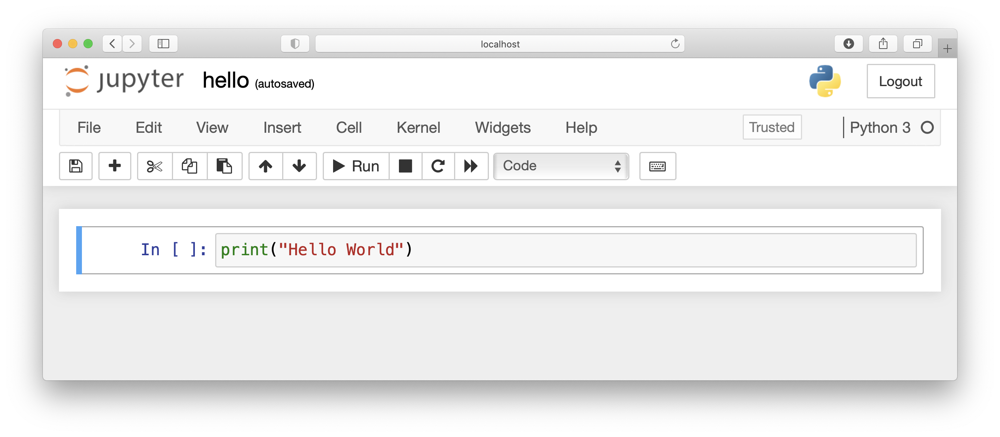
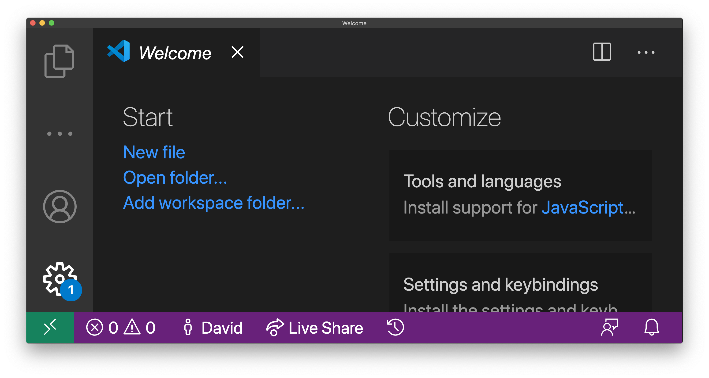
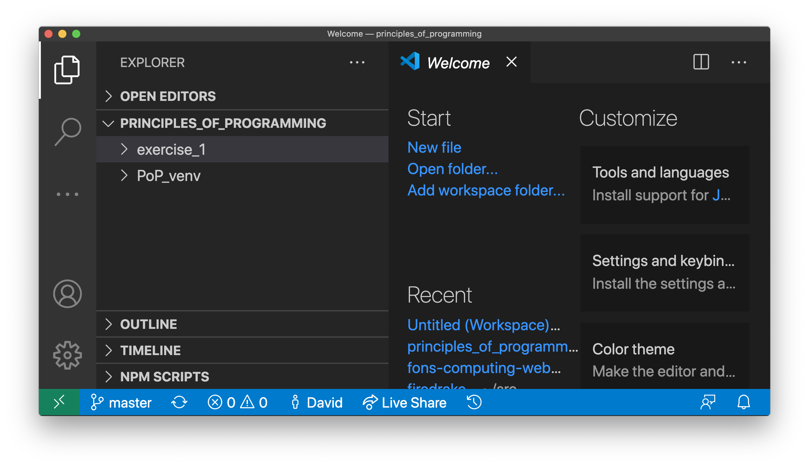
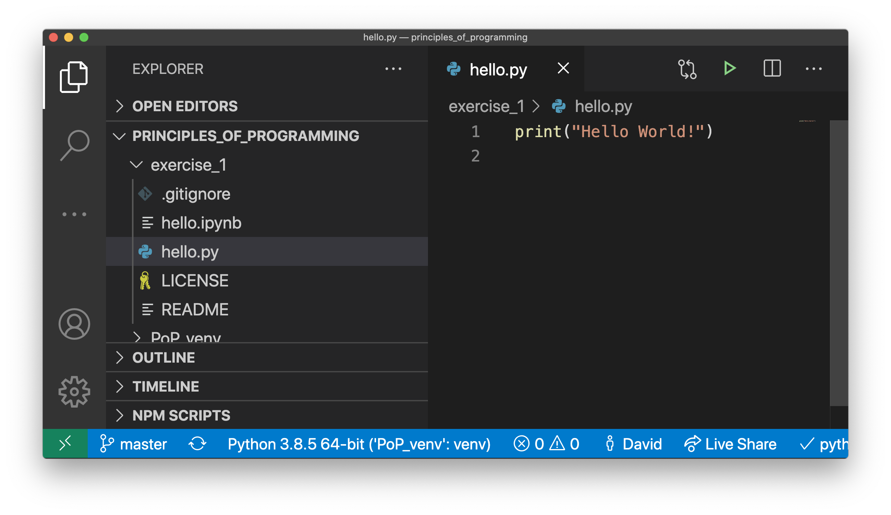
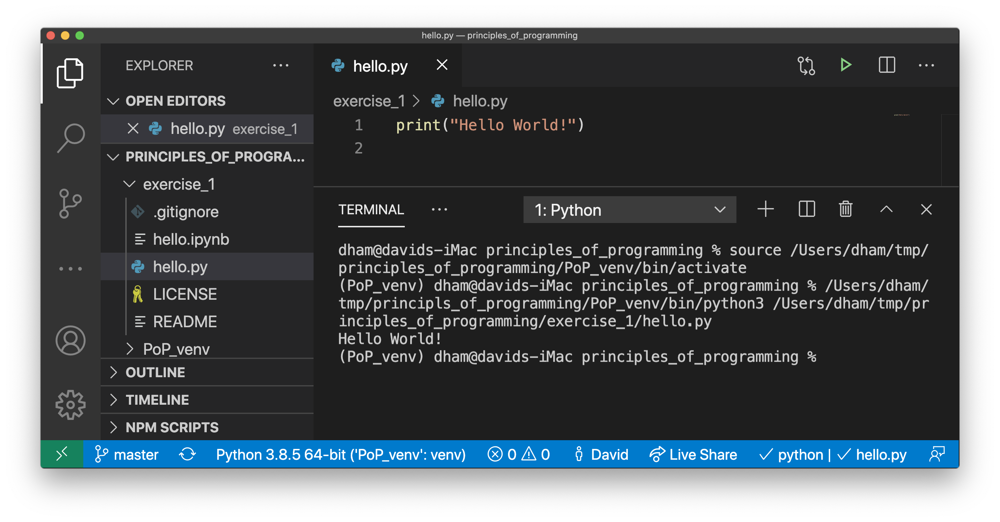
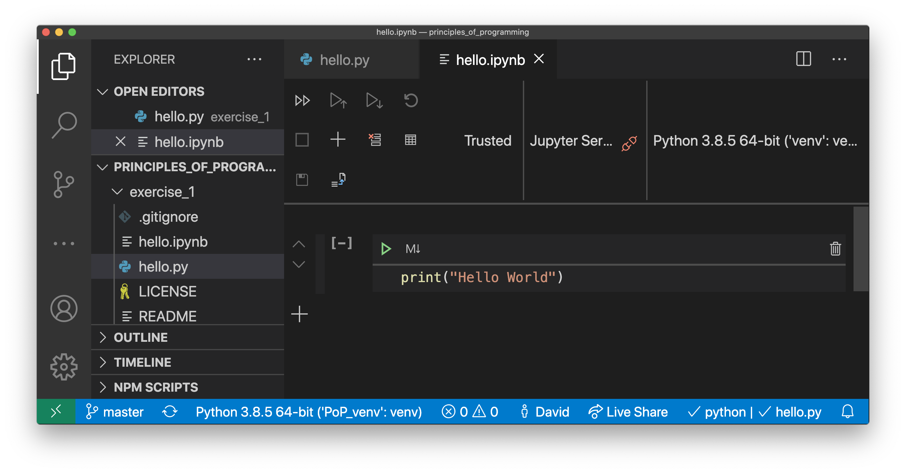
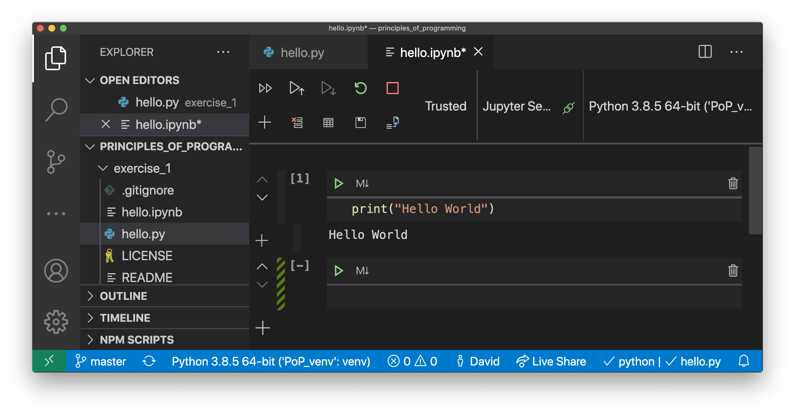

.. _python:

Python
======

Python is an interpreted high-level programming language used in many modules
with a numerical computing component. There are several ways to install Python
on your computer, but most modules will assume that you are using the Anaconda
distribution, so that's the one whose installation we primarily document here.
If you have another Python 3 distribution installed, then this is likely to
work, however your mechanism for installing additional Python packages may not
be the same as that documented in the lecture materials, so you may have to sort
that out for yourself.

Python 2 and Python 3
---------------------

Python has just completed a decade-long major version transition from Python 2
to Python 3. As of 1 January 2020 Python 2 is officially unsupported, even for
critical security updates. The instructions here are for the installation of
Python 3. Don't try to use Python 2 for your work as it is unsupported and
increasingly likely to have breakages which won't be fixed.

Installing Python in Windows
----------------------------

You can obtain Anaconda `using the Anaconda Windows installation site
<https://docs.anaconda.com/anaconda/install/windows/>`__. Simply follow the
instructions there to download and run the installer.

Installing Python on Mac
------------------------

Homebrew install Anaconda
.........................

If you've installed :ref:`homebrew` then you can install Anaconda by 
to :ref:`opening a terminal <terminal>` and run the following command:

.. code-block:: console

    $ brew cask install anaconda

When asked, enter your Mac password. On this occasion we're not quite done
because Homebrew is quite conservative about installing a new Python over
another one you might have installed. We're going to need to tell the terminal
that we want Anaconda to be our default Python.

The way we do this depends slightly on which command line program (or "shell")
we are using. The default on recent MacOS is `zsh`, but if you've been using
MacOS for a while and haven't changed, you might be using `bash`. Just to be on
the safe side, we'll run both commands. If you know for sure which shell you are
using, then you can just run the appropriate one. If you're not sure, run both:

.. code-block:: console

    $ echo 'export PATH=/usr/local/anaconda3/bin:$PATH' >> ~/.zshrc
    $ echo 'export PATH=/usr/local/anaconda3/bin:$PATH' >> ~/.bash_profile

Then close the terminal and open a new one to make sure the changes have taken
effect. Run the following command to check that Anaconda is working properly:

.. code-block:: console

    $ conda --version
    conda 4.8.3

Don't worry if the version you see installed is not the same as that listed here.

Download and install Anaconda
.............................

You can also install Anaconda on your Mac by downloading the Anaconda installer
and installing it yourself. This is documented on `the Anaconda MacOS
installation website <https://docs.anaconda.com/anaconda/install/mac-os/>`_.

Homebrew Python
...............

An alternative to using Anaconda is to install Python directly using
:ref:`Homebrew <homebrew>`. Simply run:

.. code-block:: console

    $ brew install python

This will automatically ensure that the command `python3` points to the correct
Python installation, however the Python package installation mechanism won't be
the Anaconda one. Instead you will use Python's standard package installer
`pip`. For example if you need to install `numpy` and `matplotlib` (the core
numerical computing and plotting packages), as well as support for Jupyter
notebook, you would run:

.. code-block:: console

    $ python3 -m pip install numpy matplotlib jupyter

.. warning::

    MacOS also comes with Python pre-installed. However this is a very cut-down
    version which is really only intended for internal use by the operating system.
    You should install a fully-featured Python (i.e. Anaconda or Homebrew).

Installing Python on Linux or Chrome OS [#Chrome]_
--------------------------------------------------

Every Linux distribution includes a fully-featured Python, and this might
well be enough for your needs. However if you would prefer to have the same
Python distribution as most of your classmates, then there are instructions for
installing Anaconda on `the Anaconda Linux install website <https://docs.anaconda.com/anaconda/install/linux/>`_.

Installing Python packages on Linux
...................................

If you're using the system-installed Python, as opposed to Anaconda, then you
should use the Python package manager `pip` to install any additional packages
that you need. There are a couple of issues with this of which you should be
aware. First, not all Linux distributions install `pip` by default, often you
need to install an additional package called something like `python-pip`. For
example, on Ubuntu you would run:

.. code-block:: console

    $ sudo apt-get install python3-pip

In some cases, it can become confusing which version of Python a particular
`pip` installation belongs to. This can be avoided by always invoking pip using
`python3 -m pip` rather than just typing `pip` or `pip3`.
  
While on Fedora and related distributions, you would run:

.. code-block:: console

    $ sudo dnf install python-pip

It's also possible to install quite a lot of Python packages using the Linux
package manager in a similar way. However, you will probably want to install at
least some packages using pip. For example if you wanted to install Jupyter you
would type:

.. code-block:: console

    $ python3 -m pip install --user jupyter

The `--user` option tells pip to just install for the current user. This is
preferable to using `sudo` and to install packages globally, as it removes any
risk of interfering with packages that the operating system needs.

.. _python_virtual_environments:

Python Virtual Environments
---------------------------

Before we move on to actually installing packages, we need to give a
little thought to where the packages are to be installed. We could
simply install packages into the Python installation on our
computer. This can be a reasonable approach if all you want to do is
run code from the default versions of public packages. However, it has
a number of limitations. Basically, a Python installation is a single
namespace for packages, so if two different projects you are
working on need two different versions of the same package, you're out
of luck. Similarly, if you are working on changes to a package, you
probably don't want your half-finished experimental work to be the
package that your other projects use.

Python virtual environments, or venvs, are separate namespaces within
a Python installation. They have their own Python command and
collection of packages. Effectively they behave like their own
separate Python installation, except that most of the core Python
files are shared, so a venv takes rather little additional space.

.. _create_venv:

Creating a venv
...............

The most straightforward way to create a venv is on the terminal
command line, not from within Python itself. This is accomplished
using Python's :mod:`venv` package. For example, to create a venv
called `my_venv`, you would type:

.. code-block:: console

   $ python3 -m venv my_venv

Don't forget that the `$` stands for the command prompt: you don't
type it. This command will create the folder `my_venv` and various
subfolders containing things like the Python program itself and space
for any packages which you install in the venv. If there was already a
file or folder called `my_venv` in the current folder then you'll get
an error, so make sure you choose a new name.

A venv doesn't usually contain any particularly valuable data, so you
should regard them as essentially disposable. In particular, if
something goes wrong when creating a venv, just delete it and start
again. In the bash or zsh shells you would type:

.. code-block:: console

   $ rm -rf my_venv

.. warning::

   `rm -rf` will delete its argument and all its subdirectories
   without further prompts or warnings. There is no undo operation.
   Be very careful about what you delete.

.. _activate_venv:

Using a venv
............

If you run Python from the terminal, then the simplest way to use the
venv is to source its activate script. If using bash or zsh on Mac or
Linux you would type:

.. code-block:: console

    $ source my_venv/bin/activate

while using bash on Windows you would type:

.. code-block:: console

    $ source my_venv/Scripts/activate

If using PowerShell on Windows then you type:

.. code-block:: console

    > .\my_venv\Scripts\activate.ps1

Obviously, you would use the folder name of your venv instead of
`my_venv`. In either case, your command prompt will change to indicate
that you are now using the venv. It might look something like:

.. code-block:: console

   (my_venv) $

Any subsequent invocations of Python commands such as `python3` will
now use the version from the venv, with access to whatever packages
you have installed in that venv. If you are using a terminal shell
other than bash or zsh, then see the :mod:`venv` package documentation
for the correct activation command.

.. hint::

   Venv activation is just for one terminal session. You need to
   activate the venv every time you open a new terminal.  If you find
   that Python can't find your packages or tests, then the first thing
   to check is whether you remembered to activate the venv.

Installing packages in a venv
.............................

When the venv is active, the pip installing packages will use the pip from the
venv, and the packages will be installed in the venv and not globally. For
example if you needed Numpy and Matplotlib, you would type the following in the
:ref:`terminal <terminal>`:

.. code-block:: console

    (my_venv) $ python3 -m pip install numpy matplotlib

.. _python_folders:

Recommended folder layout for a Python module
---------------------------------------------

In order to do the coursework for a typical module using Python, you'll want to
have a venv for the module, so that packages and software you use in different
modules don't interfere with each other, and you'll usually want to have one
folder for each assignment that is set in the module. If the module is using
:ref:`GitHub Classroom <github_classroom_exercise>` then each of these exercise folders
will be a git repository.

Suppose, then, that we are taking a module called Principles of Programming. We
would use a folder structure like this::

    principles_of_programming
    ├── PoP_venv
    ├── exercise_1
    ├── exercise_2
    ├── exercise_3
    └── ...

Let's see how we would set this up. First, :ref:`open a terminal <terminal>`.
You can also do several of these steps graphically, but the precise steps are
harder to explain, and are different on different operating systems.

The terminal will usually open in your home folder. Maybe you want to put the module
folder straight in your home folder, or maybe you want to put it somewhere else.
This just comes down to how you organise the files on your computer. On my
computer, I like to keep this sort of folder in a documents folder called `doc`.
So I need to switch into that folder first with the `cd` (change directory)
command:

.. code-block:: console

    $ cd doc

Now we create the main module folder using `mkdir` (make directory):

.. code-block:: console

    $ mkdir principles_of_programming

.. hint:: Avoid spaces in names

    Even though spaces are usually allowed in file and folder names, many
    software packages contain bugs which cause them to fail to handle spaces in
    names correctly. It's therefore good practice not to have spaces in file or
    folder names.

Now we change into the folder we just created:

.. code-block:: console

    $ cd principles_of_programming

.. hint:: Use tab completion

    Most modern terminals (or, rather, the shell program inside) support tab
    completion. This means that you can press the :kbd:`tab` key to have the terminal
    complete command and file names. In this example, rather that typing out
    `principles_of_programming`, you can type `pr` + :kbd:`tab` and, so long as this is
    the only name in the current folder starting with `pr`, the shell will
    insert the rest of the name. If there are more names starting with `pr` then
    you may have to type more characters before tab completion will work. 

    Tab completion is often preferable to typing because it's not only faster
    but avoids typos.

Next we :ref:`create the venv <create_venv>`. We could call it anything we like,
but we would probably like a name which is short (because it's going to appear
at the start of every line in the terminal), describes which venv this is, and
says that it's a venv. In this case, the name `PoP_venv` will do nicely:

.. code-block:: console

    $ python3 -m venv PoP_venv

When that completes, we'll need to :ref:`activate the venv <activate_venv>`. On Windows we would
type:

.. code-block:: console

    $ source PoP_venv/Scripts/activate

While on Mac or Linux it would be:

.. code-block:: console

    $ source PoP_venv/bin/activate

Next we'll install whichever Python packages we need for the module. Let's
suppose we just need Jupyter:

.. code-block:: console

    (PoP_venv) $ python3 -m pip install jupyter

Finally, we'll need to create the folder for the first exercise on our module.
If the module is not using GitHub Classroom then you'll just use `mkdir` to make a
folder for each exercise. However for GitHub Classroom modules there will be a
Git repository to clone for each exercise. As a demonstration, we can use this
`example Git repository <https://github.com/imperiallearn/exercise_1>`__. Unlike
most coursework repositories, this one is public so anyone can clone it.
Assuming we've :ref:`installed Git <git-windows>`, we can type:

.. code-block:: console

    (PoP_venv) $ git clone https://github.com/imperiallearn/exercise_1.git

If we now examine the contents of the current folder with `ls` (list) then we
can see that we have the venv folder and the exercise folder as expected:

.. code-block:: console

    (PoP_venv) $ ls
    exercise_1  PoP_venv

The `exercise_1` repository contains a simple "Hello World" program written as
both a Python file and a Jupyter notebook. For example we can run the file
version thus:

.. code-block:: console

    (PoP_venv) $ python3 exercise_1/hello.py
    Hello World!

Or we can launch the Jupyter version:

.. code-block:: console

    (PoP_venv) $ cd exercise_1
    (PoP_venv) $ jupyter notebook hello.ipynb

This pops up a web browser showing:

Using Visual Studio Code with Python
------------------------------------

Visual Studio Code provides excellent support for editing and debugging Python,
both plain Python files and Jupyter Notebooks. Visual Studio Code also supports
Python virtual environments, and revision control in Git.

Opening your Python project as a workspace
..........................................

We'll assume here that you've set up your Python folder structure :ref:`as we
recommended above <python_folders>`. One of the reasons for choosing that folder
structure is that it works well with Visual Studio Code. Having :ref:`installed
Visual Studio Code <visual-studio-code>`, and launched it, you should see a screen like this:

Click on `Open folder...` and select the module folder from the dialog (in the
case above, the folder `principles_of_programming)`. You should see a screen
somewhat like this:

Running a Python file
.....................

Click on the little arrow `>` next to `exercise_1` and then click 
`hello.py` to open it. If this is the first time you've opened a Python file in
Visual Studio code, it may prompt you to install the Python extension, and you
should agree. It might also prompt you to install a Python linter, which is a
program which checks your code against the Python style rules. You should agree
to that too. The result should look something like the following:

There are two important things to note here. The first is the text at the bottom
`Python 3.8.5 64-bit ('PoP_venv':venv)`. This shows us which Python installation
Visual Studio Code is using, and in particular that it's found our `PoP_venv`
virtual environment. Visual Studio will automatically find a virtual environment
that is in the folder you open, which is one of the reasons for our folder
layout. The other important feature is the green triangle at the top right.
Clicking on this will open a terminal and run this code:

Looking at the bottom left, we can see that Visual Studio Code has opened a
terminal, activated the virtual environment, and then run Python on our file
`hello.py`. The result is the text `Hello World!` printed out. 

Opening a Jupyter notebook
..........................

If we instead click on `hello.ipynb` then this Jupyter notebook will open. You
might be asked whether to trust the notebook, and you should agree. The result
will be something like this:

If you're used to Jupyter notebooks opening in your web browser, then this may
look a bit strange, but it's actually just the same interface, albeit in
slightly unfamiliar colours. Clicking on the green triangle, or clicking in the
code box and pressing :kbd:`shift` + :kbd:`enter` will run the code:

.. rubric:: Footnotes

.. [#Chrome] To use these installation instructions for Chrome OS you first need to :ref:`set up Linux on your Chromebook <linux-chrome>`.
