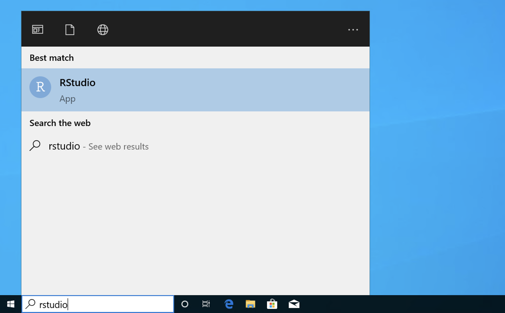
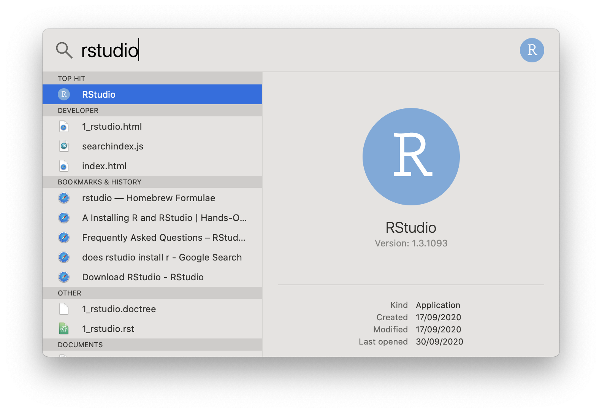

R and RStudio
=============

R is a high-level interpreted programming language used in many modules with a
statistical component. RStudio is an integrated development environment (IDE)
for R, providing editing, debugging and much more.

Note that it is not necessary to have RStudio in order to use R, 
but **RStudio is highly recommended**.

Also note that in most of the cases below (excluding the approach using 
Software Hub), R must be installed before trying to install RStudio.

Installing R and RStudio on Windows
-----------------------------------

Software Hub
~~~~~~~~~~~~

Navigate to the `Software Hub <https://softwarehub.imperial.ac.uk/>`__, scroll
down to RStudio (or type it in the search box) and click `Launch`. The RStudio
on Software Hub also includes R so you don't need to install it separately.

Further information on using the Software Hub is available on the `Imperial ICT
Software Hub webpage <https://www.imperial.ac.uk/admin-services/ict/self-service/computers-printing/devices-and-software/get-software/software-hub/>`__.

Direct install
~~~~~~~~~~~~~~

The current version of R can be obtained from the `Comprehensive R Archive

Network Windows download page <https://cran.rstudio.com/bin/windows/base/>`__. The click
on the latest release link (it will be called something like `Download R 4.0.2 for Windows`, but
the version may be newer than that). Run the installer and accept all of the
default options.

RStudio can be installed from the `RStudio install page
<https://rstudio.com/products/rstudio/download/#download>`__. Usually the big
blue button will automatically detect the right version. Again, run the
installer and accept the default options.

Running RStudio
~~~~~~~~~~~~~~~

Simply type `rstudio` in the search box at the bottom left of your screen.

Installing R and RStudio on Mac
-------------------------------

Homebrew
~~~~~~~~

The easiest way to install R and RStudio on Mac is to :ref:`install Homebrew
<homebrew>` and then run the following commands :ref:`in the terminal
<terminal-mac>`:

.. code-block:: console

    $ brew cask install r
    $ brew cask install rstudio

Direct install
~~~~~~~~~~~~~~

The current version of R can be obtained from the `Comprehensive R Archive
Network Mac download page <https://cran.r-project.org/bin/macosx/>`__. The click
on the latest release link (it will be called something like R-4.0.2.pkg, but
the version may be newer than that). Run the installer and accept all of the
default options.

RStudio can be installed from the `RStudio install page
<https://rstudio.com/products/rstudio/download/#download>`__. Usually the big
blue button will automatically detect the right version. Again, run the
installer and accept the default options.

Running RStudio
~~~~~~~~~~~~~~~

You launch RStudio by pressing `⌘ + space` to open Spotlight search and
type `rstudio` in the resulting search box:

Installing R and RStudio on Linux
---------------------------------

It's likely that your Linux distribution ships a suitable version of R. For
example on Ubuntu you would run:

.. code-block:: console

    $ sudo apt install r-base

On Fedora you would run:

.. code-block:: console

    $ sudo dnf install R

There are further details about installing R for various Linux distributions on
the `Comprehensive R Archive Network Linux folder
<https://cran.r-project.org/bin/linux/>`__. 

You next need to download the RStudio package for your distribution from the `RStudio install page
<https://rstudio.com/products/rstudio/download/#download>`__. Once again, the
install mechanism depends on the distribution. For Fedora and related packages,
you may be able to simply double click on downloaded `.rpm` file. This might
also work with the downloaded `.deb` file for Ubuntu, but you can also do it in
the :ref:`terminal <terminal>` by running the following command in the folder
containing the downloaded `.deb`:

.. code-block:: console

    $ sudo apt install <deb_file>

Obviously you replace `<deb_file>` with the name of the `.deb` file.

