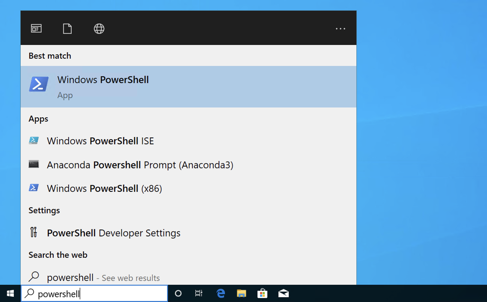
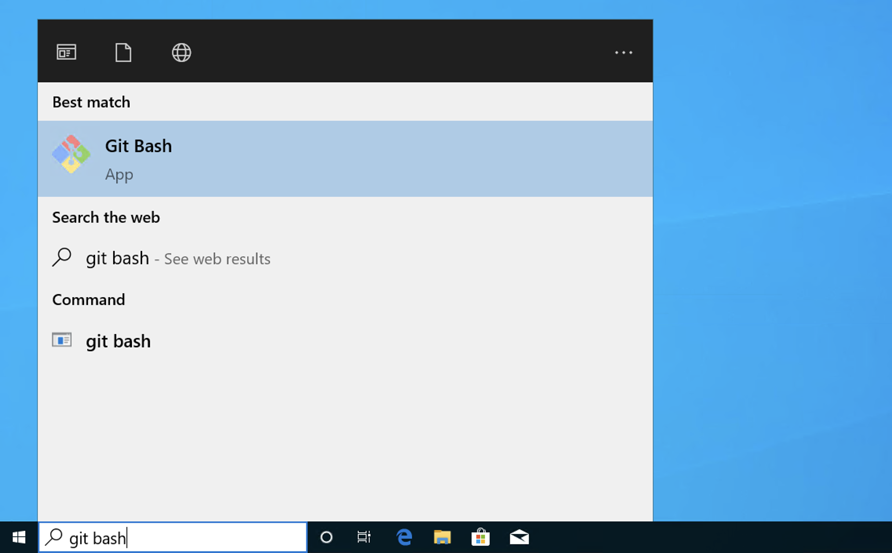

.. _terminal:

Opening a terminal
==================

A terminal is a text window which enables you to run programs on your computer
by typing their name, often followed by various options, commands, or data file
names. The terminal is often also called the command line. It may also be
referred to by the specific name of the program which interprets the text
commands, such as Bash, Zsh or, for Windows, Powershell. The name for a program
which interprets text commands like this is a "shell", so you might also see the
terminal referred to as the shell. Full instructions on how to use the terminal
are beyond the scope of this document, but some of the installation and
configuration steps described here need to be run in a terminal so its important
that you at least know how to start one.

If you need to know more about how to use a command line terminal then you
should follow the `Software Carpentry tutorial on the Unix Shell <https://swcarpentry.github.io/shell-novice/>`_.

.. _terminal-windows:

Windows
-------

On Windows you can either run Windows' own terminal, Powershell, or the Git Bash
terminal that is installed when you :ref:`install git <git-windows>`.

To run Powershell, simply type `powershell` into the search box at the bottom
left of the screen.

Similarly, if you have :ref:`installed git <git-windows>` then you can run Git
Bash by typing `git bash` into the search box:

.. _terminal-mac:

MacOS
-----

The simplest way to open a terminal on MacOS is to press `⌘ + space` to open
Spotlight Search and then type `terminal` in the search window.

Linux
-----

The terminal is such an intrinsic part of working with Linux that you probably
already know how to launch a terminal on your system. Depending on your
distribution and choice of graphical user interface, the terminal programme
might be called `terminal`, `gnome-terminal`, `konsole`, `xterm`, or possibly
something else.

If you're not sure how to launch a terminal, then here are a few ways to find it:

    1. On Ubuntu and, possibly, some other distributions, press `Ctrl + Alt + T`.
    2. Click on the terminal icon in the menu bar.
    3. Press the Windows key to bring up a menu. The terminal program might
       appear in the menu, or you can start typing `terminal` in the text box that
       appears.

Opening a terminal within Visual Studio Code
--------------------------------------------

If you have installed :ref:`visual-studio-code` then you can launch a terminal
from within the program by selecting `new terminal` in the `terminal` menu. This
will start a new terminal at the bottom of the Visual Studio Code Window.

